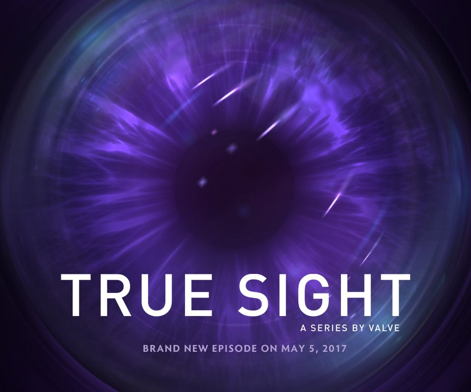

  <h1>True Sight Style Score Chart Generator</h1>
  
  
  

    Generating True Sight Style Score Chart using your favorite teams.
  

  
  
<!-- Badges -->

  
  
  
  
  
  

<!-- Table of Contents -->
# :notebook_with_decorative_cover: Table of Contents

- [:notebook\_with\_decorative\_cover: Table of Contents](#notebook_with_decorative_cover-table-of-contents)
  - [:star2: About the Project](#star2-about-the-project)
    - [:camera: Screenshots](#camera-screenshots)
  - [:rocket: Quick Start](#rocket-quick-start)

<!-- About the Project -->
## :star2: About the Project

When watching the documentary True Sight puts out on the Ti final, there are graphs of the score interspersed. Such score charts have an epic feel to them and often make us fantasize about the epicness of the final battle when our two favorite teams meet in the finals. So I made a quick tool to generate such scoreboards.

<!-- Screenshots -->
### :camera: Screenshots

 
  

<!--How to quickly use it-->
## :rocket: Quick Start

Visit this link to see: [https://final-score-true-sight.streamlit.app/](https://final-score-true-sight.streamlit.app/)